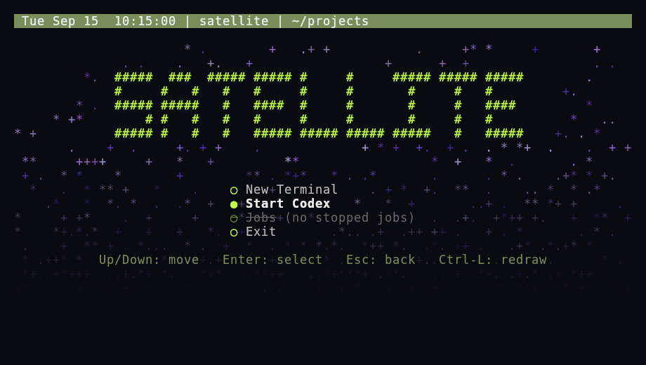

# SATELLITE CLI

Bash startup menu with a live status bar, an animated fading star field, Codex
session controls, and shell job controls.



The preview is rendered from the actual Bash menu functions with a simulated
clock and jobs. The still [preview image](media/menu-preview.png) is available too.

## Load and run

Keep this folder at `scripts/cli/` beside `.bashrc`:

```text
.bashrc
scripts/cli/
  init.bash
  config.example.bash
  config.bash          # personal, ignored by Git
  theme.bash
  font.bash
  render.bash
  stars.bash
  actions.bash
  select.bash
  menu.bash
```

The installed `.bashrc` sources the entry point with:

```bash
source -- "$(CDPATH='' cd -- "$(dirname -- "${BASH_SOURCE[0]}")" && pwd -P)/scripts/cli/init.bash" || return
```

This resolves against the location of `.bashrc`, including paths with spaces;
it does not depend on your working directory. Reload and open the menu with:

```bash
source ~/.bashrc
startup
```

Sourcing only defines the functions, colors, and `startup` alias. It does not open
the menu, attach tmux, or start Codex. Reloading `.bashrc` reloads every module.
Personal aliases (including `cxr`) and the shell prompt remain in `.bashrc`.

Requires Bash 4+, `date`, `stty`, and `clear`. Codex actions additionally need
`tmux` and `codex`. Job switching requires an interactive shell with job control.

## Where to customize

| File | Contents |
| --- | --- |
| `init.bash` | Module loading and the `startup` alias |
| `theme.bash` | Shared colors, disabled styles, and status background |
| `config.example.bash` | Tracked defaults; title falls back to `MAIN MENU` |
| `config.bash` | Optional personal title/color overrides; ignored by Git |
| `font.bash` | Block lettering that adapts to the configured title |
| `menu.bash` | Main menu entries and action dispatch |
| `actions.bash` | New Terminal, Codex, and Jobs actions |
| `render.bash` | Title, status, stars, geometry, and control hints |
| `stars.bash` | Stateful twinkles, diagonal hue sweeps, and protected text areas |
| `select.bash` | Arrow keys, disabled options, scrolling, focus, and resize handling |

### Personal title and colors

Edit `config.bash`, then run `source ~/.bashrc`. This installation keeps
`EZ_MENU_TITLE='SATELLITE'` there. On a fresh checkout, copy
`config.example.bash` to `config.bash` to start customizing; without a local
config, the title is `MAIN MENU`.

Loading resets the theme and example defaults before applying local overrides.
The local config is sourced Bash, so use trusted settings. You can override any
`C_*` color from `theme.bash` there as well. Star colors should use the existing
256-color escape format for the static renderer. Animated stars accept both
256-color and RGB escape formats.

ASCII letters, digits, spaces, and hyphens become block lettering automatically;
other characters use a plain title. Narrow or short screens use the plain title,
clipped to the available width. Fit calculations follow the configured title's
dimensions, so changing its length does not require editing the renderer.

### Animated stars

Animations run in the selector at a target of 20 frames per second, updating
only changed star and accent cells between foreground redraws. No background worker or
extra runtime dependency is needed. The title, option block, markers, hints, and
status bar remain readable over stars; viewport changes rebuild the field.

Twinkles start one at a time, with random opportunities spaced 1–200 ms apart
at the default 2.5× rate. The rate setting scales opportunity frequency
multiplicatively, preserving the probability curve instead of clipping its peaks.
Their fades may overlap, but a frame never spawns a group or catches up missed births.
They ease from dark to bright white over 120 ms, changing from `.` to `+` to `*`,
then reverse over 780 ms and disappear. If a twinkle consumes a baseline star,
that star disappears from its original position. Once the twinkle ends, a new
baseline star spawns at a different empty cell using the original horizon weights.
It eases in from black to its chosen color over 500 ms, retaining its glyph and
saturation without a white flash. The usual shimmer can cross it during that fade.
Twinkles on empty cells add no baseline stars. Replacements wait if no space is
available, so the field keeps its baseline population over time.
A smooth, sine-shaped probability ranges from 100% between sweeps
to 20% at its trough. The entire curve leads the shimmer midpoint by 500 ms,
so births lessen sooner and recover earlier. Births remain rarer during the
sweep, while existing twinkles keep fading through it.

Every four seconds, a diagonal band travels from the top left to the bottom right
in about 1.47 seconds. Broad slow shoulders give each outer quarter of the diagonal
40% of the travel time, making the ease visible beyond the tiny corners. The middle
keeps the previous sweep's peak speed; each flash still rises for 60 ms and fades
for 240 ms. Stars quickly approach white, then slowly regain saturation with
a 74° hue shift that persists after the band passes. Star shimmer peaks are pure
white across the top 30% of the field. Over the remaining 70%, peaks fade toward
black one row beyond the field; the bottom uses the step before black. Ordinary
twinkle brightness and text accent fades remain independent.
Stars and title characters briefly turn bold around their own near-white sweep
peak, then return to normal weight as they fade. The selected option stays bold.
The star field now reaches the control hints and up to two rows below them when
the terminal has room. The row fade starts at 65% at the first option and approaches
5% one row beyond the field. That darkest endpoint is excluded, leaving the last
visible row at the preceding color step. Baseline density is half the original
quantity: it eases upward quadratically from a 1-in-16 chance at the top to
3-in-8 at the bottom, creating a dense, dim horizon. This multiplier does not
reduce the twinkle rate. Twinkle frequency follows the horizon gradient: the original
uniform opportunities remain, with extra opportunities weighted by each row's
density above baseline. Uniform births take priority, so the horizon cannot
crowd out the top when reaching the one-birth-per-frame limit. Both streams use
the same 2.5× rate setting and smooth sweep envelope.

Baseline stars leave spaces inside option labels and the circle-to-label gap
empty, including spaces in visible disabled notes. Initial generation and
replacement use the same exclusions. If scrolling places these spaces over
existing baseline stars, those stars relocate using the normal replacement fade.
Twinkles retain their existing spawn rules. Stars still extend through control
hint spaces and around the option block.
Foreground letters and circle markers always win over stars. The background
retains its state under text, so scrolling reveals existing stars rather than
rerandomizing them. The title keeps its surrounding clear space.

Stars share one central hue, with stable offsets in a 60° total range (±30°).
The offsets approximate a Gaussian distribution with a 10° standard deviation,
so most are near the center. Each star also gets a random baseline saturation
between its palette color's original saturation and 80%, retained for its lifetime.
The title and option circles join the same sweep with a shared hue 180°
opposite the center of the star palette. Their baseline hue advances by the same
74° per sweep. Selected-option bolding and disabled-marker strike/dimming remain
intact during the title's bold flash. Control hints share the title
hue at 35% saturation and 55% brightness, and join the same diagonal sweep.
During each sweep the full-width status background eases from
the previous settled hint color to the next, then holds that color.

Clock ticks update the status bar alone; navigation repaints the option area.
Full repairs on focus, resize, Ctrl-L, and a five-second fallback paint the final
animated cells directly, avoiding blank or original-color underlays that caused
title flicker. The fallback still repairs terminals that omit focus events.

Override these settings in ignored `config.bash`, then source `.bashrc`:

```bash
EZ_MENU_ANIMATE_STARS=1          # 0 restores stationary stars
EZ_MENU_SWEEP_INTERVAL_MS=4000  # time between sweep starts
EZ_MENU_TWINKLE_ADVANCE_MS=500  # lead relative to the sweep midpoint; 0 restores original timing
EZ_MENU_TWINKLE_RATE_PERCENT=250 # 100 = original rate; 250 = 2.5x (range 1–1000)
EZ_MENU_STAR_DENSITY_PERCENT=50 # baseline quantity relative to the original (range 0–100)
EZ_MENU_HORIZON_DENSITY_PERCENT=600 # bottom vs top density; 100 = flat (range 100–800)
EZ_MENU_SWEEP_DURATION_MS=1467  # total movement and final flash
EZ_MENU_SWEEP_HUE_STEP=74       # degrees added per sweep
EZ_MENU_STAR_SATURATION_MAX=800 # thousandths: 800 = 80%
EZ_MENU_STAR_HUE_SPREAD=60      # total range centered on the palette hue
EZ_MENU_SWEEP_ACCENT_OFFSET=180 # complementary title/marker hue
```

Invalid timing values fall back to defaults. Duration is at least 300 ms and the
interval leaves at least 1800 ms between sweeps. Durations below 600 ms also
shorten individual flashes to leave room for movement. Non-TTY/numeric
menus stay static. Animation state survives navigation, focus, and Ctrl-L within
the selector; opening a new selector starts a fresh field.

### Menu entries

Edit `menu_items` in `menu.bash` to add or reorder options. Each entry is:

```text
Label|action_function|close_or_stay|optional_enabled_check|optional_disabled_note
```

For example, define `my_action` in `actions.bash`, then add:

```bash
'My action|my_action|stay'
```

Use `close` to leave the menu after a successful action, or `stay` to return to
it. An enabled check returns zero when available; a nonzero result disables the
option. Disabled notes disappear as a whole when they cannot fit. Use plain text
without `|` in these fields. Numbering, alignment, scrolling, and the star fade
adapt to the option list and terminal size.

Actions execute in the calling shell so `fg` can resume its jobs. The selector
alone uses a subshell to isolate cursor and signal cleanup. Its visible output
goes to stderr; stdout returns the selected zero-based index.

## Current behavior

- Up/Down moves the selection, Enter selects, Escape leaves, and Ctrl-L redraws.
- Exit is the last option and runs `exit` in the current shell.
- The status bar fills the screen. Hints use 4, 2+2, or 1+1+1+1 layouts.
- Option rows form a centered, left-aligned block with a fixed arrow slot.
- Stars animate without reshuffling on clock ticks or navigation. Side stars
  keep a clear gutter around the options and fade darker toward the bottom.
- Codex resumes tmux session `codex` through `cxr`, or validates a starting
  directory and creates `codex` running
  `codex --dangerously-bypass-approvals-and-sandbox`.
- Detach from a Codex session opened through the menu with Ctrl-B, then D, to
  return to SATELLITE with Resume Codex selected. The session keeps running.
- Jobs is disabled when this shell has no stopped jobs. When available, it lists
  running and stopped shell jobs and offers foreground/termination actions.
- Interactive options use ○, changing to ● in place when selected. The marker
  column stays the same width for any number of options. The non-TTY fallback
  retains numbers for typed selection.
- Disabled Jobs has a dark purple struck marker and a dark gray struck label;
  its `(no stopped jobs)` explanation is not struck through.
- The menu uses an alternate screen and repairs on focus/resize and periodically.
  It restores terminal modes before launching an action or returning to the shell.

## Validation

```bash
bash tests/smoke.bash
bash tests/stars.bash
perl tests/terminal.pl
```

The smoke check validates syntax, repeated `.bashrc` loading, the `startup`
alias, and relocation into a path with spaces. An alternate `.bashrc` can be
provided as its first argument. Deterministic animation checks cover text masks,
twinkle replacement/lifetime, diagonal timing, hue shifts, and lower-row peaks.
The terminal checks require Perl `IO::Pty` and
exercise navigation, resize/focus, Codex arguments, and temporary test jobs.
They stub tmux and do not launch Codex or operate on your existing shell jobs.
Set `EZ_CLI_BASHRC` to test a different `.bashrc` with the terminal suite.

To regenerate the README preview on a system with Node.js and DejaVu Mono fonts:

```bash
npm install --prefix tools
bash tools/preview-frames.bash > /tmp/satellite-frames.ansi
node tools/render-preview.cjs /tmp/satellite-frames.ansi media
```

These rendering dependencies are only for the README preview; the menu needs
none of them at runtime.

### Renderer performance

The animation still targets 20 FPS with the same cells, colors, timing, random
draws, and effects. The renderer groups changed cells into ordered output runs,
reuses cursor/style/color state, and visits only active twinkles and the moving
shimmer band. Integer lookup tables preserve the original easing exactly.
Upcoming hues are prepared in small idle-frame batches, and arrow movement
updates the affected markers without rebuilding the field.
The work index groups arrivals into 16 ms buckets while every cell retains its
exact millisecond timing. Twinkle and replacement easing use exact lookup tables;
batched integer calculations and combined terminal style/color commands reduce
shell and terminal parsing overhead.

Measured over two identical runs on x86_64 Linux / Bash 5.3.3, at the original
100% baseline density before the separate change to a 50% default:

| Viewport / options | Mean sweep frame, before → after | 95th percentile, before → after | Output per sweep frame |
| --- | --- | --- | --- |
| 80×24 / 4 | 49 → 9 ms | 57 → 28 ms | 3,917 → 2,419 bytes |
| 160×40 / 16 | 157 → 26 ms | 179 → 92 ms | 11,876 → 6,997 bytes |

These timings measure Bash computation and output generation; terminal painting
and device speed vary. The larger stress case can still exceed the 50 ms frame
budget at the busiest point. These optimization gains involved no reduction in
visual effects or density; the later 50% baseline setting is a separate visual choice.

With the 50% baseline, replenishment, and original full-height shimmer fade, a separate
run (including replacement fade-ins) measured 7 ms mean / 20 ms p95 at 80×24
and 16 ms mean / 51 ms p95 at 160×40.
Those figures include the intentional density change and are not a measurement
of optimization alone.

A further optimization pass, preserving those same frames, reduced sweep times
to about 5 ms mean / 16 ms p95 at 80×24 and 13 ms mean / 44 ms p95 at 160×40.

Run a deterministic benchmark without opening the menu:

```bash
LC_ALL=C bash tools/benchmark.bash 80 24 4 > /tmp/menu-benchmark.csv
node tools/benchmark-summary.cjs /tmp/menu-benchmark.csv
```

For renderer changes, save the original `stars.bash` before editing and compare
actual terminal cells, including RGB, bold/strike, status colors, and repair frames:

```bash
git show HEAD:stars.bash > /tmp/stars-reference.bash
# After editing:
BENCH_CAPTURE=/tmp/menu-before.frames LC_ALL=C bash tools/benchmark.bash 80 24 4 /tmp/stars-reference.bash > /tmp/menu-before.csv
BENCH_CAPTURE=/tmp/menu-after.frames LC_ALL=C bash tools/benchmark.bash 80 24 4 > /tmp/menu-after.csv
node tools/compare-frames.cjs /tmp/menu-before.frames /tmp/menu-after.frames
```

Set `BENCH_SCENARIO=1` on both capture commands to include selection changes,
scrolling, resizing, and a pause that skips multiple sweeps. Optimization was
checked against 720 matching frames across normal, large, and changing layouts.
The further pass also checks irregular frame intervals with `BENCH_JITTER=1`.
For a reference renderer that already supports work buckets, use
`BENCH_REFERENCE_CACHE=1` to include its caches in a fair timing comparison.

## Git

This folder is its own local repository. The integrating `.bashrc` is outside
the repository; the source line above documents that connection.

All commits must use the verified GitHub identity:

```text
Ana Jahnel <48846277+anastaci1a@users.noreply.github.com>
```

Repository-local Git configuration sets both author and committer defaults to
this identity. No GitHub remote is required for local version history.
