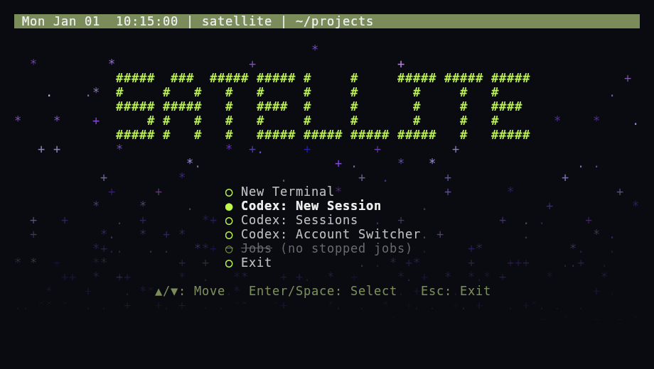

# SATELLITE CLI

A Bash menu for Codex tmux sessions, stopped shell jobs, and the Codex Switcher
dashboard. Its animated star field adapts to your terminal size.



## Get started

Place this directory at `~/scripts/cli` and add this line to `~/.bashrc`:

```bash
source -- "$(CDPATH='' cd -- "$(dirname -- "${BASH_SOURCE[0]}")" && pwd -P)/scripts/cli/init.bash" || return
```

Then reload your shell and open the menu:

```bash
source ~/.bashrc
startup
```

Sourcing the file only defines commands; it does not open the menu. Bash 4+,
`date`, `stty`, and `clear` are required. Codex integration needs `tmux`, `jq`,
and a current `codex-switcher` with enrolled accounts. Keep the same
`CODEX_SWITCHER_HOME` in your shell and switcher service.

## Use the menu

Use Up/Down to choose an option and Enter or Space to select it. Esc goes back;
in a submenu, Left focuses `◀— Back` and Right returns to the options. Text
fields use Left/Right to move the cursor. The on-screen hints show the controls
available on each screen.

- **New Terminal** returns to your shell. **Exit** exits that shell.
- **Codex: New Session** appears when no sessions exist and asks for a unique
  name, starting directory, and account. The directory picker starts at your current
  directory, lets you browse or type a path, and can create a new directory.
  Session names may contain letters, digits, spaces, and `_+-=~()[]`.
- **Codex: Sessions** lists live sessions, idle sessions
  marked `*`, and saved conversations marked `(inactive)`, newest first within
  each group when recency is available. The list updates live; working sessions
  have an animated indicator and remain selectable. Brackets show the enrolled
  identity nickname. Session Details shows the underlying account provenance.
  Discovery failures are shown explicitly, with retained live rows marked unknown.
- Open a session to **Resume** it, **Start** its exact saved conversation,
  **Rename** its display label, **Move To Account**, **Relocate Project**, or
  **Restart** its live terminal. Backends supporting **Pause Session** and
  **Terminate** expose those actions too; Terminate retains the saved conversation.
  Relocation can change the root directory or
  move the whole folder, with a review before queueing. Switcher handles history,
  permissions, account homes, safe stopping, storage checks, and recovery.
  Saved conversations reopen in their original home, including the default Codex
  home. Capacity warnings do not prevent opening context; Codex enforces limits
  when you send work. The switcher dashboard also provides Open and Archives
  recovery as a fallback.
- **Codex Jobs** shows durable operation progress and full explanations. Review
  numbered pause, background-task, and risk confirmations before responding.
  Closing a screen leaves jobs running; Cancel Job requests cancellation before
  the restart boundary. Recover Interrupted Job asks switcher to restore the
  source when safe. Full Details includes retained backup and staging paths;
  the menu never removes those directories.
- **Codex: Account Switcher** opens the account dashboard. Automatic switching
  remains unavailable. Delete is omitted until switcher exposes a safe backend
  command for it.
- **Jobs** manages stopped jobs from this shell. It is unavailable when none
  exist.

Detach from a Codex or dashboard tmux session with Ctrl+B, then D. The menu
returns; the Sessions list keeps the same session selected. If Codex fails
during startup, its pane keeps the error visible until you terminate it.
Display aliases and menu-open recency are stored under
`${XDG_STATE_HOME:-~/.local/state}/satellite-cli`; conversation history stays
under switcher's control.

## Customize

Create a Git-ignored `config.bash` (copy `config.example.bash` if starting
fresh), change the settings you want, and run `source ~/.bashrc`. The portable
title is `MAIN MENU`; this installation uses `SATELLITE` in its local config.
Set `EZ_MENU_ANIMATE_STARS=0` for stationary stars. Colors can be overridden
with the `C_*` values in `theme.bash`. Edit `menu_items` in `menu.bash` to
change the main menu.

## Check changes

```bash
bash tests/smoke.bash
bash tests/backend.bash
bash tests/watch.bash
bash tests/switcher.bash
bash tests/session_focus.bash
bash tests/move.bash
bash tests/launch.bash
bash tests/stars.bash
perl tests/terminal.pl
```

Tests use fake or isolated sessions and do not operate on your live Codex
sessions. The terminal suite needs Perl `IO::Pty`. Contributor rules and renderer
benchmark commands are in [AGENTS.md](AGENTS.md).

The backend contract is documented in Codex Switcher's
`docs/CLI_MAIN_MENU_INTEGRATION.md`. The menu uses `sessions --all` and
`sessions --all --watch` for inventory, `status --json` for account choices,
`run --account` for new launches, `open --session ID` for saved conversations,
and durable move/restart/relocate/pause/terminate jobs for changes.
